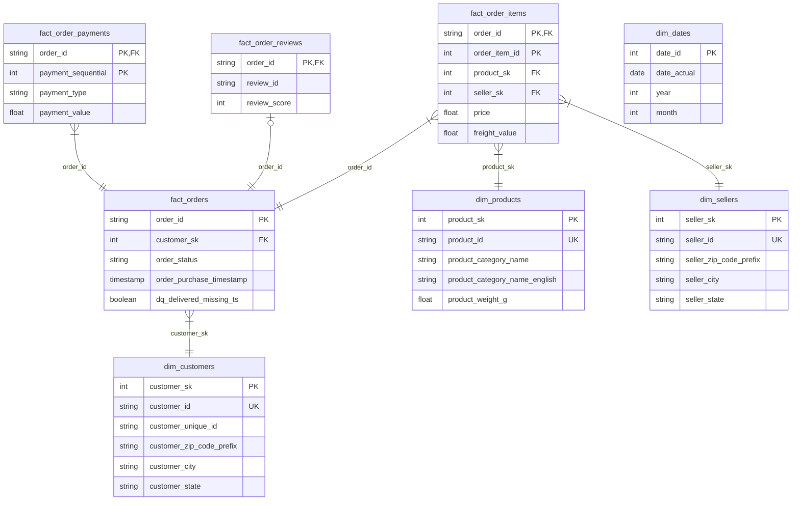

# Olist Data Warehouse ERD

This diagram illustrates the star schema of the dimensional warehouse.

```mermaid
erDiagram
    fact_orders }|--|| dim_customers : "customer_sk"
    fact_order_items }|--|| fact_orders : "order_id"
    fact_order_items }|--|| dim_products : "product_sk"
    fact_order_items }|--|| dim_sellers : "seller_sk"
    fact_order_payments }|--|| fact_orders : "order_id"
    fact_order_reviews |o--|| fact_orders : "order_id"

    dim_customers {
        int customer_sk PK
        string customer_id UK
        string customer_unique_id
        string customer_zip_code_prefix
        string customer_city
        string customer_state
    }

    dim_products {
        int product_sk PK
        string product_id UK
        string product_category_name
        string product_category_name_english
        float product_weight_g
    }

    dim_sellers {
        int seller_sk PK
        string seller_id UK
        string seller_zip_code_prefix
        string seller_city
        string seller_state
    }

    dim_dates {
        int date_id PK
        date date_actual
        int year
        int month
    }

    fact_orders {
        string order_id PK
        int customer_sk FK
        string order_status
        timestamp order_purchase_timestamp
        boolean dq_delivered_missing_ts
    }

    fact_order_items {
        string order_id PK, FK
        int order_item_id PK
        int product_sk FK
        int seller_sk FK
        float price
        float freight_value
    }

    fact_order_payments {
        string order_id PK, FK
        int payment_sequential PK
        string payment_type
        float payment_value
    }
    
    fact_order_reviews {
        string order_id PK, FK
        string review_id
        int review_score
    }
```
